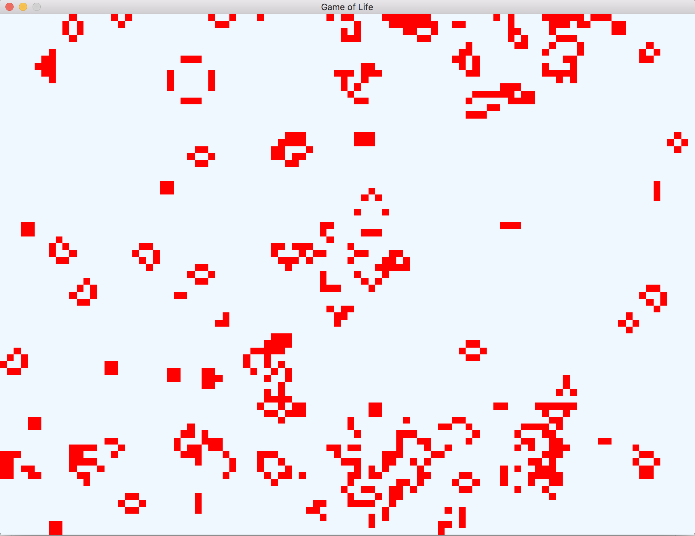

# Game of Life with Go and Pixel

A quick implementation of the [Game of Life](https://en.wikipedia.org/wiki/Conway%27s_Game_of_Life), written in Go. Uses the [Pixel](https://github.com/faiface/pixel) package to render 2D graphics.

Defaults to a 100x100 grid with a random seed pattern.

